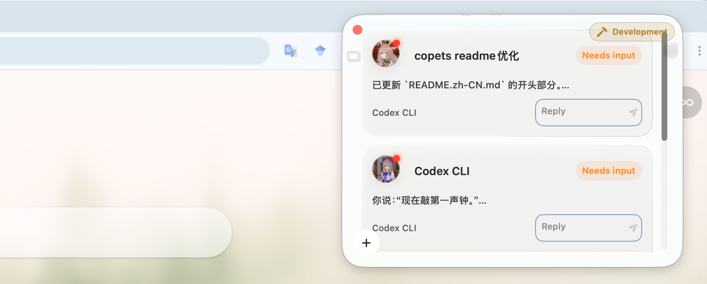
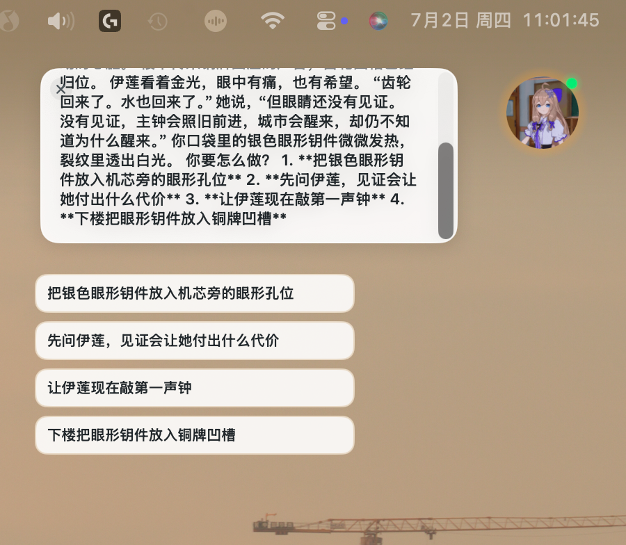

# Corptie

[English README](README.md)

**一个为异步 AI Agent 工作流设计的桌面悬浮终端。**

<p align="center">
  
</p>

Corptie 提倡更少占用注意力的 Agent 交互方式，让所有 Agent 成为全局副驾驶。它通过尽量简洁的悬浮窗和悬浮球，让用户与 Agent 的交互聚焦在对话本身，最大程度减少界面侵占，让用户在部署 Agent 任务的过程中，更少打断自己的其他工作流。


## ✨ 项目亮点

| 能力 | 价值 |
| --- | --- |
| 🧭 **多 Agent 桌面监督** | 同时观察多个长时间运行的 Agent，不必一直守在终端或聊天窗口里 |
| 🫧 **分离浮球** | 把一个会话从主列表里抽出来，变成桌面上的小型陪伴式入口，支持回复气泡和快捷输入 |
| 🪟 **桌面级存在感** | 始终置顶的悬浮界面让 Agent 工作跨越当前窗口存在，而不是被困在某个聊天页或终端页里 |
| 🧠 **多agent支持** | 聚焦交互能力，核心Agent能力 仍然交给现有的各种强大的Agent，目前支持CodeX/Claude |
| 🧪 **依托LLM能力优化交互** | 除了主Agent的能力，Corptie也会设置全局的独立LLM API优化交互，如，对含有可选项的文本化Agent回复，自动生成可快捷点击的选项 |

## 🖥️ 界面截图

## 🎬 演示视频

[观看 YouTube 演示视频](https://youtu.be/OqqVC_ITiYc)

### 主悬浮面板



### 分离悬浮球（模型执行中状态）


### 快捷选项交互




## 🧩 架构

```text
apps/macos
  SwiftUI + AppKit 原生桌面前端
  悬浮面板、分离浮球、设置页、聊天/详情视图

apps/backend
  Node.js 本地运行层
  HTTP API、SSE 详情流、PTY Agent 管理、SQLite 存储

scripts
  开发启动、生产后端辅助脚本、macOS 打包
```

Codex CLI 会话通过专用 PTY 适配器启动，支持恢复会话、中断任务、切换模型、处理 approval，并把实时详情流式推给前端。托管会话会禁用 Codex 自动更新，避免正在运行的会话被更新流程中断。

## 🚦 环境隔离

| 环境 | 后端 | 数据目录 |
| --- | ---: | --- |
| 正式版 | `127.0.0.1:47321` | `~/Library/Application Support/Corptie/` |
| 开发版 | `127.0.0.1:47322` | `~/Library/Application Support/Corptie Development/` |

两个环境不共享后端配置、SQLite 数据、前端 `UserDefaults`、透明度设置和窗口尺寸记忆。

## 🛠️ 开发

```sh
scripts/run-development.sh
```

常用检查：

```sh
curl "http://127.0.0.1:47322/health"
swift build --package-path apps/macos
node --check apps/backend/src/server.mjs
```

创建一个 Codex PTY 会话：

```sh
curl -X POST "http://127.0.0.1:47322/codex/pty-sessions" \
  -H "content-type: application/json" \
  --data '{"title":"Codex smoke test","prompt":"Summarize this repo without editing files.","cwd":"/path/to/corptie"}'
```

如果 `prompt` 为空，Corptie 会自动发送一条很短的初始化提示，让 Codex 回复 `Ready`，这样新会话会立即完成绑定并可用。

## 📦 打包

构建生产安装包：

```sh
scripts/package-macos-installer.sh
```

产物会写入 `dist/`，包含带时间戳的 `.pkg` 和 `.dmg`。`.dmg` 内含 `Corptie.app`、`Applications` 快捷入口和简短安装说明。

## License

[Apache-2.0](LICENSE)
