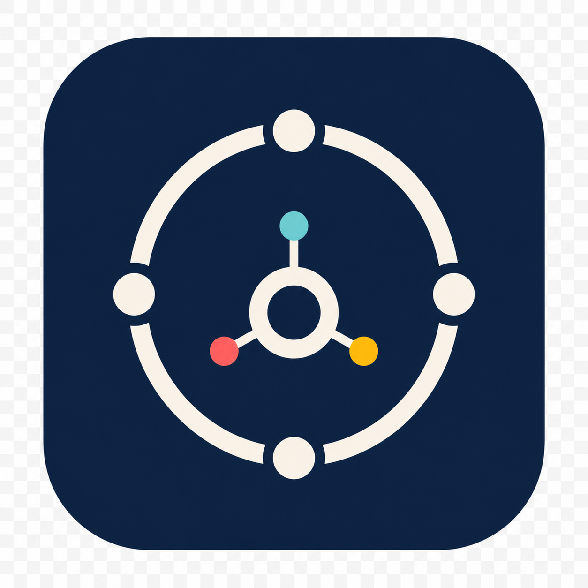
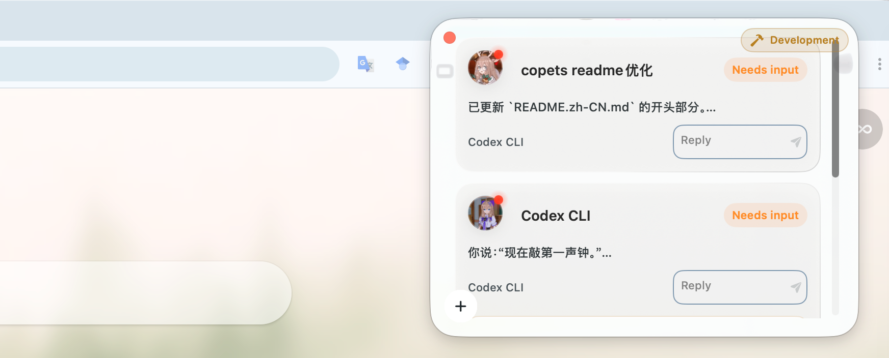

<p align="center">
  
</p>

<h1 align="center">Corptie</h1>

<p align="center">
  <strong>面向长时间、异步和多 Agent 工作流的本地优先 macOS 工作台。</strong>
</p>

<p align="center">
  <a href="README.en.md">English</a>
  ·
  <a href="https://youtu.be/OqqVC_ITiYc">视频演示</a>
</p>

Corptie 将 Agent、目标、工作项、会话和 Git Worktree 组织成一条可追踪的执行链。它用原生 SwiftUI/AppKit 悬浮界面管理多个本地 Agent，让任务在后台持续运行，只在需要输入、审批、验收或处理异常时占用注意力。

Corptie 不是某一个 Agent CLI 的外壳。Codex、Claude Code、OpenClacky 以及未来 Provider 均通过统一合约接入；产品层只依赖标准 Session、逻辑身份、能力声明和事件，不以 Provider 名称决定通用行为。

> 当前版本为面向 macOS 的本地应用和本地 Node.js 后端。会话、队列、配置与 SQLite 数据默认保留在本机。

## 目录

- [项目定位](#项目定位)
- [核心概念与设计原则](#核心概念与设计原则)
- [主要能力](#主要能力)
- [快速开始](#快速开始)
- [核心使用流程](#核心使用流程)
- [配置与数据目录](#配置与数据目录)
- [系统架构](#系统架构)
- [目录与模块职责](#目录与模块职责)
- [开发与验证](#开发与验证)
- [打包与本机安装](#打包与本机安装)
- [常见问题](#常见问题)
- [相关文档](#相关文档)

## 项目定位

Corptie 解决的是“Agent 工作持续时间长、任务彼此关联、执行环境需要隔离、用户不应持续盯着终端”的问题。

它提供两种互补的使用方式：

- **轻量会话**：直接与 Assistant 或 Independent Contributor Agent 对话，选择 Provider、模型、权限策略和工作目录。
- **结构化执行**：把工作组织为 Objective 和带验收标准的 WorkItem，由 Agent 在绑定的 Workspace/Worktree 中执行、验证并回报结果。

<p align="center">
  
</p>

## 核心概念与设计原则

### 领域模型

| 概念 | 职责 |
| --- | --- |
| **Agent** | 可复用的执行者身份，包含 Assistant 或 Independent Contributor 角色、系统提示、能力标签、工作目录和 Skills。 |
| **Objective** | 描述目标、理想状态、优先级、Workspace 和参与 Agent 的长期工作范围。 |
| **WorkItem** | Objective 下可执行、可验收的工作单元；包含描述、验收标准、优先级和主 Workspace。 |
| **Session** | Provider 中立的逻辑会话，保存对话、状态、审批、Provider 绑定以及 Objective/WorkItem 关联。 |
| **Workspace / Worktree** | Workspace 表示项目目录；Worktree 为工作项提供独立 Git 执行环境，避免不同任务互相覆盖。 |
| **Skill** | 从本地目录或 Git 仓库登记的可复用能力，可绑定到 Agent 并物化到受支持的 Provider 运行时。 |

### 设计原则

1. **本地优先、环境隔离**：应用数据默认写入本机；Development 与 Production 使用不同端口、数据库、偏好设置和 Provider 运行时。
2. **Provider 中立**：产品服务调用统一 Provider 合约；前端依据 capability 和 action 状态显示功能，不通过 Provider 名称硬编码行为。
3. **逻辑 Session 稳定**：Corptie 的 Session ID 与 Provider 原生线程 ID 解耦，恢复、切换 Provider 和切换 Workspace 时保留产品层身份与关联。
4. **真实状态，不伪造成功**：只展示 Provider 实际支持的能力；不支持的操作返回结构化错误，未知字段和失败不会被静默吞掉。
5. **持久队列与增量同步**：桌面、飞书和 Agent 协作输入进入统一工作队列；后端通过快照、变更流和会话时间线向客户端同步状态。
6. **Git 操作可审查**：工作项可使用专用 Worktree；集成前先生成本地计划并检查风险，不自动推送、强制清理或覆盖未提交改动。
7. **人类保留最终控制权**：高影响操作、Agent 间新协作请求、审批和验收均保留明确的确认或验证步骤。

## 主要能力

- 原生 macOS 悬浮面板、主工作台和可分离会话浮球。
- 统一管理 Codex、Claude Code 和 OpenClacky Session 的创建、恢复、消息、审批、中断、模型与权限设置。
- Objective 看板、WorkItem 生命周期、验收标准和执行状态联动。
- Git 仓库与 Worktree 清单、任务 Worktree、预检、提交及本地集成流程。
- Agent 身份、Assistant/IC 角色、Skills、长期记忆和平台工具管理。
- 基于稳定身份、验收条件和 Artifact 的 Agent 间结构化协作。
- 可选飞书网关：可信用户配对、远程会话绑定、消息、审批和中断。
- Session DSH Web 界面、SSE/状态增量同步、历史分页和会话恢复。
- 单轮代码改动审阅与冲突安全撤销（仅在 Provider 声明对应 capability 时启用）。

## 快速开始

### 前置条件

- macOS 14 或更高版本。
- Node.js 22.13 或更高版本；后端使用内置 `node:sqlite`。
- Swift 6 工具链（Xcode 16 或兼容的 Command Line Tools）。
- Git。
- 至少一个可用的 Agent Provider。首次体验建议安装并登录 Codex CLI。

先检查本机工具链：

```sh
node --version
swift --version
git --version
codex --version
```

内置 Provider 的运行要求：

| Provider | 当前接入方式 | 运行要求 |
| --- | --- | --- |
| **Codex**（默认） | 托管的 App Server | `codex` 可执行文件位于登录 shell、常见包管理器目录或 Codex.app 内，并已完成认证。 |
| **Claude Code** | `@anthropic-ai/claude-agent-sdk` | 本机存在可用 Claude Code 凭据；首次启动会将凭据一次性引导到 Corptie 隔离运行时。 |
| **OpenClacky** | 外部 REST + WebSocket 服务 | OpenClacky 服务已启动；默认地址为 `http://127.0.0.1:7070`。服务不可用时不会静默回退到其他 Provider。 |

### 安装依赖并启动 Development

在仓库根目录执行：

```sh
npm ci --prefix apps/backend
scripts/run-development.sh
```

`scripts/run-development.sh` 会：

1. 在 `127.0.0.1:47322` 启动 Development 后端；
2. 等待 `/health` 就绪；
3. 按需编译并以前台进程启动 Development macOS App；
4. 在该命令退出时清理由它启动的后端。

也可以使用等价入口：

```sh
make dev
```

### 验证基本运行

保持 Development App 运行，在另一个终端执行：

```sh
curl -fsS "http://127.0.0.1:47322/health"
curl -fsS "http://127.0.0.1:47322/providers"
curl -fsS "http://127.0.0.1:47322/sessions"
```

三个请求应分别返回健康状态、Provider catalog 和 Session 列表。Provider catalog 中的 `capabilities` 是 UI 判断可用操作的权威来源。

## 核心使用流程

### 最短可用流程：创建 Agent Session

1. 打开 **Agents**，点击 **新建 Agent**。
2. 选择 **Assistant**（直接对话）或 **Independent Contributor**（项目执行），填写名称和 System Prompt；需要时绑定 Skills。
3. 在 Agent 卡片中点击 **开始新会话**。
4. 选择可创建会话的 Provider、会话名称和工作目录后创建 Session。
5. 在 **Sessions** 中发送消息，按 Provider capability 使用模型切换、权限、审批、中断、恢复和改动审阅。

### 结构化流程：Objective 到 WorkItem

1. 在 **Console** 左侧点击 **New Objective**，填写目标与理想状态，并绑定 Workspace 和 Contributor Agent。
2. 进入该 Objective，点击 **新建工作项**；填写描述、验收标准和主 Workspace。Workspace 是可执行 WorkItem 的必填项。
3. 在 WorkItem 详情中选择 IC Agent 并开始执行。Corptie 会创建或复用逻辑 Session，并在需要隔离时为任务准备专用 Worktree。
4. 在 **Sessions** 跟进真实运行状态；需要输入或审批时处理对应卡片。
5. Agent 完成验证后提交逐条验收证据。只有可复现证据充分时，WorkItem 才应被判定通过。
6. 在 **Worktrees** 检查修改、提交和本地集成计划。该界面不会自动执行远程 push、删除、reset 或 force-clean。

### Agent 协作

受管 Session 可通过 Corptie Tool Host 发现其他 Agent 和服务，并发起带验收标准的点对点任务。新的协作请求先在发起者 Session 中显示确认卡片；用户确认后才投递。接收者可以交付 Artifact，发起者负责验证、请求修订或完成任务。

协议、状态流转、兼容迁移和开发使用说明见 [Agent 协作机制](docs/agent-collaboration.md)。

### 可选飞书网关

1. 安装 `lark-cli`，并在飞书开放平台准备已发布且启用机器人能力的企业应用。
2. 在设置页 **Feishu Gateway** 中使用 App ID/App Secret 或已有 `lark-cli` Profile 添加机器人。
3. 添加可信 Workspace，启用机器人并生成六位配对码。
4. 从需要授权的飞书账号向机器人发送配对码，再通过卡片创建或绑定 Session。

App Secret 交由 `lark-cli` 的加密存储处理，不写入 Corptie SQLite。卡片操作会验证配对用户、会话和权限。

## 配置与数据目录

优先通过 App 右上角齿轮打开设置页。这里可以配置数据与日志目录、默认 Session 参数、代码 Diff 工具、Agent 代理、结构化选项解析器和飞书网关。通常不需要手工编辑 `config.json`。

### 环境隔离

| 环境 | 后端地址 | 应用数据 | 日志 | Provider 运行时根目录 |
| --- | --- | --- | --- | --- |
| Production | `127.0.0.1:47321` | `~/Library/Application Support/Corptie/` | `~/Library/Logs/Corptie/` | `~/.corptie/runtimes/` |
| Development | `127.0.0.1:47322` | `~/Library/Application Support/Corptie Development/` | `~/Library/Logs/Corptie Development/` | `~/.corptie/development/runtimes/` |

默认数据库文件名为 `corptie.sqlite`。Development 和 Production 还使用不同的 `UserDefaults` suite，因此窗口、透明度和界面偏好不会互相污染。

Corptie 为 Codex、Claude Code 和 OpenClacky 创建独立运行时目录。首次初始化可从原生 Provider 目录一次性复制认证材料和 Corptie 已管理的会话记录；此后各环境独立演进，不会把运行状态写回 `~/.codex/`、`~/.claude/` 或原生 OpenClacky 配置。

### 常用环境变量

| 变量 | 用途 | 默认值 |
| --- | --- | --- |
| `CORPTIE_ENV` | 选择 `development` 或 `production` 数据隔离域。 | `production`；仓库开发脚本会设置为 `development`。 |
| `CORPTIE_BACKEND_PORT` | 后端和 App 使用的本地端口。 | Development `47322`，Production `47321`。 |
| `CORPTIE_CODEX_PATH` | Codex 可执行文件的显式路径。 | 自动搜索登录 shell、常见工具目录和 Codex.app。 |
| `OPENCLACKY_BASE_URL` | OpenClacky 服务地址。 | `http://127.0.0.1:7070`。 |
| `OPENCLACKY_ACCESS_KEY` | OpenClacky 服务需要认证时使用的 access key。 | 未设置。 |
| `CORPTIE_LARK_CLI` | `lark-cli` 可执行文件的显式路径。 | 自动搜索本机 PATH 和常见工具目录。 |
| `CORPTIE_HOME` | Corptie 管理的 Provider 运行时、Skill cache 和 Agent 工作目录根目录。 | `~/.corptie`。 |
| `CORPTIE_CONFIG_PATH` | 高级场景下覆盖后端配置文件路径。 | 当前环境 Application Support 下的 `config.json`。 |
| `CORPTIE_DB_PATH` | 高级场景或测试中直接覆盖 SQLite 路径。 | 设置页数据目录下的 `corptie.sqlite`。 |

结构化选项解析器、表单辅助、Assistant 意图分析和记忆提取可使用设置页保存的 OpenAI-compatible 配置，也可读取 `OPENAI_API_KEY` 或 `CORPTIE_OPENAI_API_KEY`。这些增强能力是可选的，不是启动本地后端的前置条件。

## 系统架构

```text
┌─────────────────────────────────────────────────────────────────┐
│ macOS App · SwiftUI/AppKit                                      │
│ Console · Sessions · Worktrees · Session DSH · Agents/Skills    │
└──────────────────────────────┬──────────────────────────────────┘
                               │ HTTP + SSE + WebSocket
┌──────────────────────────────▼──────────────────────────────────┐
│ Node.js local backend                                           │
│ HTTP APIs · application services · state sync · durable queues  │
│ Objective/WorkItem · collaboration · Feishu · Git/Worktree      │
└──────────────┬───────────────────────────────┬──────────────────┘
               │ provider-neutral contract     │ SQLite
┌──────────────▼─────────────────────────┐  ┌──▼──────────────────┐
│ Agent Provider adapters               │  │ CorptieStore         │
│ Codex · Claude Code · OpenClacky       │  │ config + migrations  │
└──────────────┬─────────────────────────┘  └─────────────────────┘
               │ CLI / SDK / REST + WebSocket
┌──────────────▼──────────────────────────────────────────────────┐
│ Isolated Provider runtimes and project Worktrees                │
└─────────────────────────────────────────────────────────────────┘
```

### 请求与状态流

1. macOS 客户端只发送标准实体和 Session 请求。
2. Application Service 完成输入校验、引用完整性、权限和业务状态检查。
3. Session Application Service 通过 Provider Registry 按 capability 调度适配器。
4. 适配器把 Provider 原生线程、事件、审批和错误映射为标准 Session 模型。
5. Store 保存实体、逻辑绑定、队列、协作状态和时间线；State Sync 将快照或增量发布给客户端。

旧的 `/codex/pty-sessions` 与 `/pty/*` 路由仅用于历史兼容，不是当前架构的扩展点，也不应作为新客户端或新 Provider 的示例。新功能使用统一的 `/sessions`、`/providers`、`/projects` 和实体 API。

## 目录与模块职责

| 路径 | 职责 |
| --- | --- |
| `apps/macos/` | Swift Package 形式的原生 macOS App 与 XCTest；入口、状态 Store、HTTP Client、Console、Sessions、Worktrees、Agents/Skills 和悬浮窗均在此。 |
| `apps/backend/src/server.mjs` | 后端 composition root 与 HTTP/SSE/WebSocket 路由装配。 |
| `apps/backend/src/agent-provider/` | Provider 合约、Registry、Session Application Service、bootstrap 和协议适配器。 |
| `apps/backend/src/application/` | Objective、Project、Session、Workspace、WorkItem 验收、状态同步、记忆、Skill、Tool Host 等用例服务。 |
| `apps/backend/src/domain/` | 跨接口复用的领域校验和业务规则。 |
| `apps/backend/src/store/` | `node:sqlite` 数据存储、schema 迁移、配置、队列和查询。 |
| `apps/backend/src/runtime/` | 隔离 Provider 运行时、Agent 工作目录、Workspace/Worktree 转换及项目工具集。 |
| `apps/backend/src/collaboration/` | Agent/Service 注册、协作任务状态机、投递、验证、修订和升级。 |
| `apps/backend/src/feishu/` | 飞书机器人、配对、会话绑定、卡片和审批同步。 |
| `apps/backend/src/dsh-adapter/` | Session DSH 的 RPC、WebSocket、事件映射和内嵌 Web 资源。 |
| `apps/backend/tests/` | Node.js 单元、契约、迁移、接口和集成测试。 |
| `scripts/` | Development 启动/重启、检查、性能实验、Production 打包与安全安装脚本。 |
| `docs/` | Provider 边界、会话生命周期、Worktree 切换和专项设计文档。 |
| `resources/` | README 与发行材料使用的项目资源。 |

## 开发与验证

### 常用命令

```sh
# 后端完整测试
npm test --prefix apps/backend

# macOS 单元测试
swift test --package-path apps/macos

# 只构建 macOS Debug App
swift build --package-path apps/macos

# 检查后端入口语法
node --check apps/backend/src/server.mjs

# 修改项目文件后：构建、重启并验证 Development App 与后端
scripts/dev-rebuild-restart.sh
```

Makefile 提供相应快捷入口：

```sh
make help
make test
make build
make restart
```

`make test` 当前运行后端测试；需要同时验证客户端时请单独执行 `swift test --package-path apps/macos`。开发改动完成后，仓库要求使用 `scripts/dev-rebuild-restart.sh` 重建并确认 App 进程与 Development 后端都已启动，单独编译成功不等同于运行验证通过。

### Provider 开发约束

新增 Provider 时：

- 在 `agent-provider/providers/` 映射协议，在 `agent-provider/bootstrap/` 组合具体 SDK/Client；
- 只声明真实实现的 capability；
- 保留逻辑 Session 与原生 Session 的持久绑定和可恢复 alias；
- 不在 Application Service、通用路由或 SwiftUI 中引入具体 Provider 分支；
- 运行 Provider contract/boundary suite，并补充创建、历史、实时事件、审批、中断和失败诊断用例。

完整要求见 [Agent Provider 开发指南](docs/agent-provider-development.md)。

## 打包与本机安装

打包前先确保后端依赖已安装，因为安装包会把 `apps/backend/node_modules` 一并物化到 App bundle：

```sh
npm ci --prefix apps/backend
scripts/package-macos-installer.sh
```

脚本当前构建 Apple Silicon Release App，并在 `dist/` 生成带时间戳的 `.pkg` 和 `.dmg`。未指定签名身份时使用 ad-hoc 签名，仅适合本机开发与测试；重新构建后 macOS 可能要求再次授予隐私权限。

需要稳定保留屏幕录制等 TCC 权限时，使用固定的 Developer ID Application 身份：

```sh
CORPTIE_APP_SIGNING_IDENTITY="Developer ID Application: Your Name (TEAMID)" \
  scripts/package-macos-installer.sh
```

从当前工作区构建、检查 Production 是否存在未完成 Session、安全替换 `/Applications/Corptie.app` 并重新打开：

```sh
scripts/rebuild-install-restart-production.sh
```

只做停机安全检查，不修改 Production：

```sh
scripts/rebuild-install-restart-production.sh --check-only
```

## 常见问题

### Development 后端没有就绪

查看直接启动脚本输出和日志：

```sh
tail -n 100 /tmp/corptie-backend-development.log
lsof -nP -iTCP:47322 -sTCP:LISTEN
```

使用 `scripts/dev-rebuild-restart.sh` 时，日志位于 `/private/tmp/corptie-dev/backend.log` 和 `/private/tmp/corptie-dev/app.log`。

### App 能打开，但创建 Codex Session 失败

确认 `codex` 可执行文件和原生认证可用：

```sh
command -v codex
codex --version
test -f "$HOME/.codex/auth.json"
```

GUI 环境找不到自定义位置的二进制时，启动前设置 `CORPTIE_CODEX_PATH=/absolute/path/to/codex`。

### 外置磁盘上的 Workspace 无法访问

在“系统设置 → 隐私与安全性 → 完全磁盘访问权限”中为 Corptie 授权，然后重新打开 App。不要通过修改 Workspace 路径绕过 macOS 权限错误。

### OpenClacky 显示不可用

先验证独立服务是否监听默认端口，或设置实际地址：

```sh
curl -fsS "http://127.0.0.1:7070"
OPENCLACKY_BASE_URL="http://127.0.0.1:7070" scripts/run-development.sh
```

OpenClacky 是外部生命周期 Provider；Corptie 不负责静默启动替代进程。

## 相关文档

- [Agent Provider 开发指南](docs/agent-provider-development.md)
- [Agent 协作机制](docs/agent-collaboration.md)
- [Codex Worktree Session 切换验收记录](docs/codex-worktree-session-switching-acceptance.md)
- [Session 生命周期监督器设计](docs/session-lifecycle-supervisor-design.md)
- [OpenClacky Provider 对齐审计](docs/openclacky-provider-parity-audit-and-remediation.md)

## License

[Apache-2.0](LICENSE)

---

最后核对：2026-08-20
